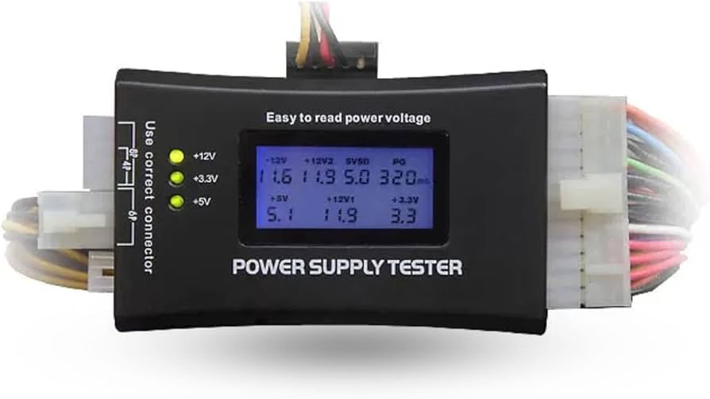

# 🚫 No Power

1. Disconnect external devices one at a time to eliminate a device that might be causing an issue.

2. Check the system's power supply. Make sure it is plugged in and working correctly (power cable going to a wall outlet, laptop charging cord, USB-C power, etc).

   - With laptops, you can use a multimeter if needed to check the voltage output reading from the charging cable/cord.

     - The center/internal pin is typically the "Hot" connection and is tested with the red lead on a multimeter. The outside, metal sleeve, is "Ground" and is tested with the black lead on the multimeter.

     - If you get a reading for 19.5V, the power supply should have that listed as it's rated power output.

     - Anything over 0.3 volts or greater can slowly start doing damage to a device and the power supply should be replaced to prevent any system damage.

3. Use a PC power supply tester to make sure all power rails are working correctly on a desktop power supply:

   - A power supply tester should indicate a good +3V, +5V and +12V power rails.

   
   *Power supply tester showing voltage readings*

   - The PG rating should be no lower than 200 and no more than 500.

   - A power supply may have just a single bad rail (3V, 5V, or 12V), and thusly could give the impression the PSU may still have some life/power. But all power rails need to be working for the PSU to function correctly and show a successful reading.

   - If a power supply tester shows NO power or signal at all, that usually indicates a full failure or the computer's power supply.

   
   *LCD Power Supply Tester showing rail voltages*

4. Check that power is actually making it into the device.

   - There is typically a light or indicator that will show that a board or device is getting power

   - If there are no power indications when you plug your device in to it's power source, and the power cable/charger is tested as being ok, gently wiggle the power connection where it plugs into the device, to see if there may be a loose connection, or if the port might be going bad, or has gone bad.
