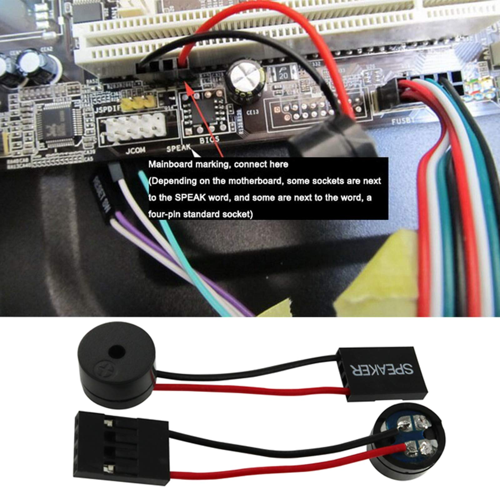
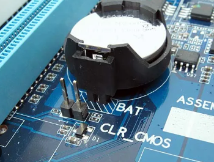

# 🚫 POST Failure: Power On Self Test

When a computer has a working CPU, RAM, Motherboard, Power Supply and GPU (onboard or add-in card), the system will "POST" and generate an image on a connected monitor. It should also allow access to the system's UEFI/BIOS settings.

If the system does NOT POST, one of the 5 main components is NOT working, is not compatible, or is installed incorrectly.

Typically if any of the previous are true, the motherboard will emit a BIOS beep code pattern to try and tell you what is wrong, and why it won't POST.

First things first, test the system's Power Supply and make sure all power rails are working and the PG rating is 200+ and below 500.

After checking the PSU, we need to see if the motherboard is trying to tell us something is wrong.

To do this, make sure there is an onboard speaker, or you hook up your own speaker to the motherboard's speaker header, to hear any BIOS beep codes the motherboard might be trying to emit.

*Motherboard speaker header location and speaker types*

Listen for any beep code patterns; such as 1 long and 3 short beeps, or 3 short beeps, etc.

Google is your friend! Google the beep pattern (1 long 3 short) along with the make of the motherboard, and you should be able to decipher the beep error pattern, and figure out what is going wrong/not working.

## SIMPLE DESKTOP MOTHERBOARD HEALTH CHECK

- Make sure a speaker is attached to the motherboard via it's appropriate header

- Remove all RAM sticks from the system

- Turn on the computer

- If the motherboard is "Alive" and has base level functionality, the board will emit a BIOS beep code pattern indicating the system RAM is missing.

- If the system emits NO beeps, first change the orientation of the speaker and it's header connection and try again.

- If the system emits NO beeps STILL, attempt a CMOS reset of the motherboard.

*CMOS battery location on motherboard*

- If STILL NO BEEPS, the motherboard has an issue/has failed and needs to be replaced.

## ▼ In-Depth No P.O.S.T. Diagnostics

If a **desktop or laptop is failing to POST** (Power-On Self-Test), it usually means there is a hardware issue preventing the system from booting. Here's a structured diagnostics process to troubleshoot the problem:

### Step 1: Check for Power Issues

**No power at all?**

- Check if the power cord is properly plugged in.

- Try a different power outlet.

- For desktops, check the **power supply unit (PSU) switch** on the back.

- For laptops, ensure the **battery is seated correctly** and try booting with just the AC adapter.

**Fans spin, but no display?**

- If the system powers on but doesn't POST, move to the next steps.

### Step 2: Inspect External Connections

**For desktops:**

- Disconnect **all peripherals** (USB devices, external drives, printers, etc.).

- Try a different monitor and cable.

- If using a dedicated GPU, try **connecting to the onboard graphics** instead.

**For laptops:**

- Try an **external monitor** to rule out display issues.

- If the keyboard backlight or LED indicators work but there's no display, the screen or GPU could be the issue.

### Step 3: Check for Beep Codes or Diagnostic LEDs

- Many desktops and laptops provide **beep codes** (if a speaker is connected) or **blinking LED sequences** indicating specific issues.

- Refer to the motherboard or laptop manufacturer's documentation for **POST codes**.

### Step 4: Reseat Components

**For desktops and laptops (if possible):**

- Reseat the **RAM sticks** (try booting with one stick at a time in different slots).

- Reseat the **GPU** (if applicable).

- Reseat the **storage drive(s)** (SSD/HDD).

- Check for any loose **power or data cables**.

### Step 5: Test with Minimal Hardware

**For desktops:**

1. Remove everything except:
   - CPU & cooler
   - One stick of RAM
   - Power supply (PSU)
   - GPU (if no onboard graphics)

2. If it still won't POST, swap RAM sticks or try another **known-good RAM stick**.

**For laptops:**

- If the **CMOS battery** is easily accessible, try **removing it for 5 minutes** and reinserting it to reset the BIOS.

### Step 6: Reset CMOS

Clear the **BIOS/UEFI settings** by either:

- Shorting the **CMOS jumper** (on desktops).

- Removing the **CMOS battery** for a few minutes.

- Holding the **power button** for 30 seconds with no power or battery connected.

### Step 7: Test the Power Supply (For Desktops)

- If the system **doesn't power on at all**, test the **PSU** using a power supply tester or try a **known-good PSU**.

### Step 8: Identify a Motherboard or CPU Issue

If all else fails and the system still won't POST:

- The **motherboard or CPU may have failed**.

- Check for any **burnt components, bent CPU pins, or bulging capacitors**.

## ▼ Using a Computer Diagnostic Card

### Choose the Right Diagnostics Card

- **PCI/PCIe POST Card** – Used for desktops, inserted into a PCI or PCIe slot.

- **Mini PCIe or LPC POST Card** – Used for laptops, connects to the mini PCIe slot or LPC debug port.

- **USB POST Card** – Some laptops support USB-based POST reading.

### Install the Diagnostics Card

1. **Power off the computer** and **unplug it** before installation.

2. Insert the **diagnostics card** into:
   - A **PCI, PCIe, or mini PCIe slot** (for desktops/laptops with these slots).
   - A **LPC debug port** (often near the RAM slots on some motherboards).
   - A **USB port** (if using a USB-based diagnostic tool).

3. **Reconnect power** and turn the computer on.

### Read the POST Codes

- When the system attempts to boot, the diagnostics card will display a **two-digit or four-digit hexadecimal code**.

- If the system **boots successfully**, the final displayed code usually indicates a normal startup (e.g., `00`, `FF`, or `AA`, depending on the motherboard).

- If the system **fails to boot**, the card will freeze at a code representing a hardware failure.

### Interpret the POST Codes

1. **Find the meaning of the displayed code:**
   - Check the **motherboard manual** for a list of POST codes.
   - Use the **diagnostics card's manual**, which often includes a generic list of common codes.
   - Some manufacturers provide **online lookup tools** for their POST codes.

2. **Common POST Code Issues:**
   - **00 or No Code** – No power or motherboard failure.
   - **C0 - C1 - C2** – RAM issues (reseat or replace memory).
   - **D0 - D1 - D2** – CPU-related failure (reseat CPU or check for bent pins).
   - **E0 - E1 - E2** – Chipset or motherboard failure.
   - **50 - 55** – RAM compatibility or installation issue.
   - **7F or 8x** – GPU or display-related failure.
   - **FF** – Some boards use this to indicate a successful boot; others may use it for failure.

### Take Action Based on the Code

- **Reseat Components** – Try reseating RAM, CPU, and GPU.

- **Swap Out Suspected Faulty Parts** – Use known-good RAM, PSU, or CPU to see if the issue persists.

- **Reset CMOS** – Clear BIOS settings by removing the CMOS battery for a few minutes.

- **Check Power Supply** – Ensure the PSU provides adequate voltage.

### Further Troubleshooting or Repairs

- If the diagnostics card points to a **CPU or motherboard issue**, you may need a **replacement**.
