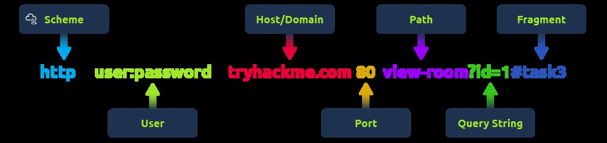

# 🤖 Networking 101

*IP Addressing, Ports, Protocols, The OSI Model, Firewalls & VPNs, etc.*

## ▼ The OSI Model: P-D-N-T-S-P-A

*Open Systems Interconnection Model*

### ▼ Network Layers Simplified (OSI Model)

- Layer 1 - Cables, Wires, etc
- Layer 2 - MAC Address (Media Access control) i.e., Physical Address
  - A switch
- Layer 3 - IP Addresses
  - A router
- Layer 4 - Transport layer (TCP, UDP & 3-way handshake)
- Layer 5 - Media (MOV, JPEG, WMV)
- Layer 6 - Application data (HTTP, SMTP, SSH, etc)

### "Please, Do, Not, Throw, Sausage, Pizza, Away"
*Process for network troubleshooting as well.*

1. Physical - Data Cables, Cat5, Cat6, etc
2. Data - Switching, MAC Addresses, etc
3. Network - IP Addressing, Routing, etc.
4. Transport - TCP/UDP
5. Session - Session Management
6. Presentation - WMV, JPEG, MOV, (media files)
7. Application - HTTP, SMTP, SSH, etc


*OSI Model 7 Layers diagram*

## ▼ Common Networking, Ports & Protocols, Etc.

### ▼ Network Protocols

- OSPF: Open Shortest Path First
- RIP: Routing Information Protocol

### ▼ Network Topologies

- Star
- Bus
- Ring

### ▼ IP Addresses

#### IP Classes:

1. Class A: 10.0.0.0
2. Class B: 172.16.0.0 to 172.31.0.0
3. Class C: 192.168.0.0 to 192.168.255.255
4. Loopback: 127.0.0.0 to 127.0.0.7
5. APIPA: 169.254.x.x
   - A **169.254.x.x** IP address is an **APIPA (Automatic Private IP Addressing)** address, which means that your computer or device was unable to obtain an IP address from a **DHCP (Dynamic Host Configuration Protocol) server**, such as a router or modem.

#### Local IP's
- 192.168.1.1
- 10.1.1.10
- 172.16.1.1

#### Public IP's
- Outside of the above IP ranges

### IPV4 - Internet Protocol Version 4
- Made of 32 bits or 4 bytes

### IPV6 - Internet Protocol Version 6
- Made up of 128 bits or 16 bytes

### NAT - Network Address Translation

**NAT (Network Address Translation)** is a technology that lets multiple devices on a private network (like your home Wi-Fi) share a single public IP address to access the internet.

Your router acts as a middleman, replacing private IP addresses with its public IP when sending data out, and then routing the responses back to the right device. This helps with security and conserves the limited number of public IP addresses available.

### MAC Addresses:

- Hardware Network Identification
- Hardware Identifiers: The first three pairs of Mac address
- Layer 2 "Switching"

## ▼ TCP - Transmission Control Protocol

| Header | Description |
|--------|-------------|
| Source Port | This value is the port opened by the sender to send the TCP packet from. This value is chosen randomly (out of the ports from 0-65535 that aren't already in use at the time). |
| Destination Port | This value is the port number that an application or service is running on the remote host (the one receiving data); for example, a webserver running on port 80. Unlike the source port, this value is not chosen at random. |
| Source IP | This is the IP address of the device that is sending the packet. |
| Destination IP | This is the IP address of the device that the packet is destined for. |
| Sequence Number | When a connection occurs, the first piece of data transmitted is given a random number. We'll explain this more in-depth further on. |
| Acknowledgement Number | After a piece of data has been given a sequence number, the number for the next piece of data will have the sequence number + 1. We'll also explain this more in-depth further on. |
| Checksum | This value is what gives TCP integrity. A mathematical calculation is made where the output is remembered. When the receiving device performs the mathematical calculation, the data must be corrupt if the output is different from what was sent. |
| Data | This header is where the data, i.e. bytes of a file that is being transmitted, is stored. |
| Flag | This header determines how the packet should be handled by either device during the handshake process. Specific flags will determine specific behaviors, which is what we'll come on to explain below. |

### ▼ Ports:
*FULL LIST*

1. FTP (File transfer protocol) - 21
2. SSH - 22 (encrypted) Similar to Telnet
3. Telnet - 23 (unencrypted) Similar to SSH
4. SMTP - 25, 587 (STARTLS), 2525,
5. SMTPS - 465
6. DNS - 53
7. HTTP/HTTPS - 80/443
8. POP3 - 110 or 995 (SSL/TLS)
9. SMB - 139 + 445 *Most common port you will see
10. IMAP - 143 or 993 (TLS/SSL)

### TCP Handshake Messages

| Step | Message | Description |
|------|---------|-------------|
| 1 | SYN | A SYN message is the initial packet sent by a client during the handshake. This packet is used to initiate a connection and synchronise the two devices together (we'll explain this further later on). |
| 2 | SYN/ACK | This packet is sent by the receiving device (server) to acknowledge the synchronisation attempt from the client. |
| 3 | ACK | The acknowledgement packet can be used by either the client or server to acknowledge that a series of messages/packets have been successfully received. |
| 4 | DATA | Once a connection has been established, data (such as bytes of a file) is sent via the "DATA" message. |
| 5 | FIN | This packet is used to cleanly (properly) close the connection after it has been complete. |
| # | RST | This packet abruptly ends all communication. This is the last resort and indicates there was some problem during the process. For example, if the service or application is not working correctly, or the system has faults such as low resources. |


*TCP 3-way handshake between Alice and Bob*

1. SYN - Client: Here's my Initial Sequence Number(ISN) to SYNchronise with (0)
2. SYN/ACK - Server: Here's my Initial Sequence Number (ISN) to SYNchronise with (5,000), and I ACKnowledge your initial number sequence (0)
3. ACK - Client: I ACKnowledge your Initial Sequence Number (ISN) of (5,000), here is some data that is my ISN+1 (0 + 1)

## ▼ UDP - User Datagram Protocol

*Stateless Protocol*

| Header | Description |
|--------|-------------|
| Time to Live (TTL) | This field sets an expiry timer for the packet, so it doesn't clog up your network if it never manages to reach a host or escape! |
| Source Address | The IP address of the device that the packet is being sent from, so that data knows where to return to. |
| Destination Address | The device's IP address the packet is being sent to so that data knows where to travel next. |
| Source Port | This value is the port that is opened by the sender to send the UDP packet from. This value is randomly chosen (out of the ports from 0-65535 that aren't already in use at the time). |
| Destination Port | This value is the port number that an application or service is running on the remote host (the one receiving the data); for example, a webserver running on port 80. Unlike the source port, this value is not chosen at random. |
| Data | This header is where data, i.e. bytes of a file that is being transmitted, is stored. |


*UDP request/response between Alice and Bob*

### Ports
*FULL LIST*

1. DNS - 53
2. DHCP - 67 + 68
3. TFTP - 49
4. SNMP - 161

## ▼ TCP, UDP, and the 3-way Handshake

- Transmission Control Protocol- TCP
  - Connection-oriented
  - Used when reliability is needed.
  - Port Related/Associated
  - Uses a 3-way handshake
    - "Syn" Packet - Initial "Hi am here" request
    - Receive a "Syn Ack" Packet - Confirmation that the request was heard and accepted.
    - Send "Ack" Packet - Connection acknowledged.

- User Datagram Protocol - UDP
  - Streaming, DNS, VoIP, connectionless data

## ▼ ARP - Address Resolution Protocol

ARP Request - A message is broadcasted on the network to other devices asking, "What is the mac address that owns this IP address?"

ARP Reply - With device's MAC Address

## ▼ DHCP - Dynamic Host Configuration Protocol

**DHCP (Dynamic Host Configuration Protocol)** is a system that automatically assigns IP addresses to devices on a network. Instead of manually setting up an IP address for each device, a **DHCP server** does it for you, making networking easier and more efficient.

It also provides other network details like the **subnet mask, gateway,** and **DNS servers**, so devices can connect and communicate properly. Most home routers have a built-in DHCP server to handle this automatically.

- DHCP Discover Packet - Asks for IP
- DHCP Offer Packet
- DHCP Request Packet - Sent once offered an IP
- DHCP ACK Packet - Acknowledgement

## ▼ DNS - Domain Name System

**DNS (Domain Name System)** provides a simple way for us to communicate with devices on the internet without remembering complex numbers. Much like every house has a unique address for sending mail directly to it, every computer on the internet has its own unique address to communicate with it called an IP address. An IP address looks like the following 104.26.10.229, 4 sets of digits ranging from 0 - 255 separated by a period. When you want to visit a website, it's not exactly convenient to remember this complicated set of numbers, and that's where DNS can help.

### ▼ What happens when you make a DNS request

1. When you request a domain name, your computer first checks its local cache to see if you've previously looked up the address recently; if not, a request to your Recursive DNS Server will be made.

2. A Recursive DNS Server is usually provided by your ISP, but you can also choose your own. This server also has a local cache of recently looked up domain names. If a result is found locally, this is sent back to your computer, and your request ends here (this is common for popular and heavily requested services such as Google, Facebook, Twitter). If the request cannot be found locally, a journey begins to find the correct answer, starting with the internet's root DNS servers.

3. The root servers act as the DNS backbone of the internet; their job is to redirect you to the correct Top Level Domain Server, depending on your request. If, for example, you request www.tryhackme.com, the root server will recognise the Top Level Domain of .com and refer you to the correct TLD server that deals with .com addresses.

4. The TLD server holds records for where to find the authoritative server to answer the DNS request. The authoritative server is often also known as the nameserver for the domain. For example, the name server for tryhackme.com is kip.ns.cloudflare.com and uma.ns.cloudflare.com. You'll often find multiple nameservers for a domain name to act as a backup in case one goes down.

5. An authoritative DNS server is the server that is responsible for storing the DNS records for a particular domain name and where any updates to your domain name DNS records would be made. Depending on the record type, the DNS record is then sent back to the Recursive DNS Server, where a local copy will be cached for future requests and then relayed back to the original client that made the request. DNS records all come with a TTL (Time To Live) value. This value is a number represented in seconds that the response should be saved for locally until you have to look it up again. Caching saves on having to make a DNS request every time you communicate with a server.


*DNS request process from client through recursive, root, and authoritative servers*

### ▼ DNS Records

#### A Record
These records resolve to IPv4 addresses, for example 104.26.10.229

#### AAAA Record
These records resolve to IPv6 addresses, for example 2606:4700:20::681a:be5

#### CNAME Record
These records resolve to another domain name, for example, TryHackMe's online shop has the subdomain name store.tryhackme.com which returns a CNAME record shops.shopify.com. Another DNS request would then be made to shops.shopify.com to work out the IP address.

#### MX Record
These records resolve to the address of the servers that handle the email for the domain you are querying, for example an MX record response for tryhackme.com would look something like alt1.aspmx.l.google.com. These records also come with a priority flag. This tells the client in which order to try the servers, this is perfect for if the main server goes down and email needs to be sent to a backup server.

#### TXT Record
TXT records are free text fields where any text-based data can be stored. TXT records have multiple uses, but some common ones can be to list servers that have the authority to send an email on behalf of the domain (this can help in the battle against spam and spoofed email). They can also be used to verify ownership of the domain name when signing up for third party services.

### ▼ DNS Tools:

NSLookUp - Look up DNS, DNS Records, Mail DNS, etc

```
nslookup --type=MX website.com
nslookup --type=TXT website.com
```

## ▼ Ports *FULL LIST*

### ▼ Well-Known Ports (0-1023)

- 20 – FTP (File Transfer Protocol) Data Transfer
- 21 – FTP Control (Command)
- 22 – SSH (Secure Shell)
- 23 – Telnet (Unsecured remote login)
- 25 – SMTP (Simple Mail Transfer Protocol)
- 53 – DNS (Domain Name System)
- 67/68 – DHCP (Dynamic Host Configuration Protocol)
- 69 – TFTP (Trivial File Transfer Protocol)
- 80 – HTTP (Hypertext Transfer Protocol)
- 110 – POP3 (Post Office Protocol v3)
- 119 – NNTP (Network News Transfer Protocol)
- 123 – NTP (Network Time Protocol)
- 143 – IMAP (Internet Message Access Protocol)
- 161/162 – SNMP (Simple Network Management Protocol)
- 179 – BGP (Border Gateway Protocol)
- 389 – LDAP (Lightweight Directory Access Protocol)
- 443 – HTTPS (Hypertext Transfer Protocol Secure)
- 465 – SMTPS (Secure SMTP)
- 514 – Syslog (System Logging)
- 515 – LPD (Line Printer Daemon)
- 993 – IMAPS (Secure IMAP)
- 995 – POP3S (Secure POP3)

### ▼ Registered Ports (1024-49151)

- 1080 – SOCKS Proxy
- 1433/1434 – Microsoft SQL Server- 1521 – Oracle Database
- 1701 – L2TP (Layer 2 Tunneling Protocol)
- 1723 – PPTP (Point-to-Point Tunneling Protocol)
- 3306 – MySQL Database
- 3389 – RDP (Remote Desktop Protocol)
- 5060/5061 – SIP (Session Initiation Protocol - VoIP)
- 5432 – PostgreSQL Database
- 8080 - Web Server, Web Proxy, etc.

### ▼ Dynamic/Private Ports (49152-65535)

#### QuickBooks Desktop 2020 and later ports:
- Uses port 8019

#### QuickBooks Desktop 2018 ports:
- Uses ports 8019, 56728, and 55378–55382

#### QuickBooks Desktop 2017 ports:
- Uses ports 8019, 56727, and 55373–55377

#### QuickBooks Point of Sale ports:
- TCP (Incoming): Uses ports 8040, 8443, 443, 2638, 46203, 46216–46220, 46225, 46228, 8024, 8025, 8035, and 8036
- UDP (Outgoing): Uses ports 2638, 8024, 8035, and 8036

#### QuickBooks Payments ports:
- Uses ports 8443 (UDP and TCP) and 443 (UDP and TCP)

### ▼ Ports Used by VPNs

- **UDP 1194** – OpenVPN (default port)
- **TCP/UDP 500** – IKE (Internet Key Exchange) for IPsec VPNs
- **UDP 4500** – NAT Traversal for IPsec VPNs
- **TCP 1723** – PPTP (Point-to-Point Tunneling Protocol)(Not recommended due to weak security)
- **UDP 1701** – L2TP (Layer 2 Tunneling Protocol)
- **TCP 443** – OpenVPN over HTTPS (used to bypass firewalls)
- **TCP 22** – SSH Tunneling for VPN-like functionality
- **TCP 465 / TCP 993** – Sometimes used by VPNs for secure email services

#### VPN Port Considerations:

- OpenVPN can be configured on **any port**, but **UDP 1194** is the default.
- IPsec-based VPNs (such as those used by Cisco, Fortinet, and others) primarily use **UDP 500 and UDP 4500**.
- Using **TCP 443** for OpenVPN allows VPN traffic to appear as regular HTTPS, helping to bypass network restrictions.

### ▼ Ports Used by NVR/DVR and Camera Systems

- **TCP 80** – HTTP (Web Interface for camera/NVR)
- **TCP 443** – HTTPS (Secure Web Interface)
- **TCP 554** – RTSP (Real-Time Streaming Protocol)
- **TCP/UDP 5000-5500** – RTP (Real-Time Transport Protocol for video/audio)
- **TCP 8080** – Alternate HTTP Port
- **UDP 3702** – ONVIF (Discovery of IP Cameras)
- **TCP/UDP 37777** – Common port for Dahua and some other brands
- **TCP 8000** – Commonly used by Hikvision
- **TCP 8554** – Alternative RTSP port
- **TCP 10000+** – Some cameras use high-numbered ports for proprietary streaming

### ▼ Ports Used by VoIP & IP Telephone Systems

#### 1. SIP (Session Initiation Protocol) – Used for call signaling

- **UDP/TCP 5060** – Standard SIP traffic (unencrypted)
- **TCP 5061** – Secure SIP (SIPS, encrypted using TLS)
- **UDP 5160** – Alternative SIP port used by some VoIP providers

#### 2. RTP (Real-time Transport Protocol) – Used for audio/video streaming

- **UDP 16384-32767** – Default RTP media ports (range varies by provider)
- **UDP 10000-20000** – Common alternative RTP range

#### 3. SRTP (Secure Real-time Transport Protocol) – Secure voice traffic

- Same as RTP ports, but encrypted (TLS/SSL)

#### 4. MGCP (Media Gateway Control Protocol) – Legacy protocol for VoIP gateways

- **UDP 2427** – MGCP Gateway communication
- **UDP 2727** – MGCP Call Agent communication

#### 5. H.323 – Alternative VoIP protocol (less common today)

- **TCP 1720** – Call signaling
- **TCP/UDP 1718-1719** – Gatekeeper communication
- **TCP/UDP 1024-65535** – Media streaming (RTP)

#### 6. IAX/IAX2 (Inter-Asterisk eXchange Protocol – Used by Asterisk PBX)

- **UDP 4569** – IAX2 (preferred over IAX)

#### 7. Proprietary VoIP Services (Common Provider Ports)

- **TCP 3478-3481** – STUN/TURN (NAT traversal for VoIP)
- **UDP 4000-4999** – Cisco VoIP (varies by model)
- **TCP 5222-5223** – XMPP (used in some VoIP apps like Google Voice)

## ▼ Packets & Frames

- **Packets** - Packets are an efficient way of communicating data across networked devices such as those because this data is exchanged in small pieces, there is less chance of bottlenecking occurring across a network than large messages being sent at once.

- **Frames** - A frame is at layer 2 - the data link layer, meaning there is no such information as IP addresses.

**It's safe to assume that when we are talking about anything IP addresses, we are talking about packets. When the encapsulating information is stripped away, we're talking about the frame itself.**

## ▼ Websites, Web Servers, HTTP, HTML, Etc.

### ▼ Domains

#### TLD (Top-Level Domain)

A TLD is the most righthand part of a domain name. So, for example, the tryhackme.com TLD is **.com**. There are two types of TLD, gTLD (Generic Top Level) and ccTLD (Country Code Top Level Domain). Historically a gTLD was meant to tell the user the domain name's purpose; for example, a .com would be for commercial purposes, .org for an organization, .edu for education and .gov for government. And a ccTLD was used for geographical purposes, for example, .ca for sites based in Canada, .co.uk for sites based in the United Kingdom and so on. Due to such demand, there is an influx of new gTLDs ranging from .online , .club , .website , .biz and so many more.

#### Second-Level Domain

Taking tryhackme.com as an example, the .com part is the TLD, and tryhackme is the Second Level Domain. When registering a domain name, the second-level domain is limited to 63 characters + the TLD and can only use a-z 0-9 and hyphens (cannot start or end with hyphens or have consecutive hyphens).

#### Subdomain

A subdomain sits on the left-hand side of the Second-Level Domain using a period to separate it; for example, in the name admin.tryhackme.com the admin part is the subdomain. A subdomain name has the same creation restrictions as a Second-Level Domain, being limited to 63 characters and can only use a-z 0-9 and hyphens (cannot start or end with hyphens or have consecutive hyphens). You can use multiple subdomains split with periods to create longer names, such as jupiter.servers.tryhackme.com. But the length must be kept to 253 characters or less. There is no limit to the number of subdomains you can create for your domain name.

### ▼ Websites; HTML, CSS, JavaScript, Etc.

When you visit a website, your browser (like Safari or Google Chrome) makes a request to a web server asking for information about the page you're visiting. It will respond with data that your browser uses to show you the page; a web server is just a dedicated computer somewhere else in the world that handles your requests.

#### There are two major components that make up a website:

1. Front End (Client-Side) - the way your browser renders a website.
2. Back End (Server-Side) - a server that processes your request and returns a response.

#### Websites are primarily created using:

- **HTML**, to build websites and define their structure
- **CSS**, to make websites look pretty by adding styling options
- **JavaScript**, implement complex features on pages using interactivity

### ▼ HyperText Markup Language (HTML)

HyperText Markup Language is the language websites are written in. Elements (also known as tags) are the building blocks of HTML pages and tells the browser how to display content.

The HTML structure has the following components:

- The `<!DOCTYPE html>` defines that the page is a HTML5 document. This helps with standardisation across different browsers and tells the browser to use HTML5 to interpret the page.
- The `<html>` element is the root element of the HTML page - all other elements come after this element.
- The `<head>` element contains information about the page (such as the page title)
- The `<body>` element defines the HTML document's body; only content inside of the body is shown in the browser.
- The `<h1>` element defines a large heading
- The `<p>` element defines a paragraph

There are many other elements (tags) used for different purposes. For example, there are tags for buttons (`<button>`), images (``), lists, and much more.

Tags can contain attributes such as the class attribute which can be used to style an element (e.g. make the tag a different color) `<p class="bold-text">`, or the src attribute which is used on images to specify the location of an image: ``. An element can have multiple attributes each with its own unique purpose, e.g., `<p attribute1="value1" attribute2="value2">`.

Elements can also have an id attribute (`<p id="example">`), which is unique to the element. Unlike the class attribute, where multiple elements can use the same class, an element must have different id's to identify them uniquely. Element id's are used for styling and to identify it by JavaScript.

You can view the HTML of any website by right-clicking and selecting "View Page Source" (Chrome) / "Show Page Source" (Safari).

### ▼ JavaScript (JS)

JavaScript (JS) is one of the most popular coding languages in the world and allows pages to become interactive. HTML is used to create the website structure and content, while JavaScript is used to control the functionality of web pages - without JavaScript, a page would not have interactive elements and would always be static. JS can dynamically update the page in real-time, giving functionality to change the style of a button when a particular event on the page occurs (such as when a user clicks a button) or to display moving animations.

JavaScript is added within the page source code and can be either loaded within `<script>` tags or can be included remotely with the src attribute: `<script src="/location/of/javascript_file.js"></script>`

The following JavaScript code finds a HTML element on the page with the id of "demo" and changes the element's contents to "Hack the Planet": `document.getElementById("demo").innerHTML = "Hack the Planet";`

HTML elements can also have events, such as "onclick" or "onhover" that execute JavaScript when the event occurs. The following code changes the text of the element with the demo ID to Button Clicked: `<button onclick='document.getElementById("demo").innerHTML = "Button Clicked";'>Click Me!</button>` - onclick events can also be defined inside the JavaScript script tags, and not on elements directly.

### ▼ Exposing Sensitive Data

Sensitive Data Exposure occurs when a website doesn't properly protect (or remove) sensitive clear-text information to the end-user; usually found in a site's frontend source code.

We now know that websites are built using many HTML elements (tags), all of which we can see simply by "viewing the page source". A website developer may have forgotten to remove login credentials, hidden links to private parts of the website or other sensitive data shown in HTML or JavaScript.

Sensitive information can be potentially leveraged to further an attacker's access within different parts of a web application. For example, there could be HTML comments with temporary login credentials, and if you viewed the page's source code and found this, you could use these credentials to log in elsewhere on the application (or worse, used to access other backend components of the site).

Whenever you're assessing a web application for security issues, one of the first things you should do is review the page source code to see if you can find any exposed login credentials or hidden links.

### ▼ HTML Injection

HTML Injection is a vulnerability that occurs when unfiltered user input is displayed on the page. If a website fails to sanitize user input (filter any "malicious" text that a user inputs into a website), and that input is used on the page, an attacker can inject HTML code into a vulnerable website.

Input sanitization is very important in keeping a website secure, as information a user inputs into a website is often used in other frontend and backend functionality. A vulnerability you'll explore in another lab is database injection, where you can manipulate a database lookup query to log in as another user by controlling the input that's directly used in the query - but for now, let's focus on HTML injection (which is client-side).

When a user has control of how their input is displayed, they can submit HTML (or JavaScript) code, and the browser will use it on the page, allowing the user to control the page's appearance and functionality.


*Example of HTML injection through a form input*

The general rule is never to trust user input. To prevent malicious input, the website developer should sanitize everything the user enters before using it in the JavaScript function; in this case, the developer could remove any HTML tags.

### ▼ Other Components

#### Load Balancers

When a website's traffic starts getting quite large or is running an application that needs to have high availability, one web server might no longer do the job. Load balancers provide two main features, ensuring high traffic websites can handle the load and providing a failover if a server becomes unresponsive.

When you request a website with a load balancer, the load balancer will receive your request first and then forward it to one of the multiple servers behind it. The load balancer uses different algorithms to help it decide which server is best to deal with the request. A couple of examples of these algorithms are **round-robin**, which sends it to each server in turn, or **weighted**, which checks how many requests a server is currently dealing with and sends it to the least busy server.


*Load balancer distributing traffic across multiple servers*

Load balancers also perform periodic checks with each server to ensure they are running correctly; this is called a **health check**. If a server doesn't respond appropriately or doesn't respond, the load balancer will stop sending traffic until it responds appropriately again.

#### CDN (Content Delivery Networks)

A CDN can be an excellent resource for cutting down traffic to a busy website. It allows you to host static files from your website, such a JavaScript, CSS, Images, Videos, and host them across thousands of servers all over the world. When a user requests one of the hosted files, the CDN works out where the nearest server is physically located and sends the request there instead of potentially the other side of the world.

#### Databases

Often websites will need a way of storing information for their users. Webservers can communicate with databases to store and recall data from them. Databases can range from just a simple plain text file up to complex clusters of multiple servers providing speed and resilience. You'll come across some common databases: MySQL, MSSQL, MongoDB, Postgres, and more; each has its specific features.

#### WAF (Web Application Firewall)

A WAF sits between your web request and the web server; its primary purpose is to protect the webserver from hacking or denial of service attacks. It analyses the web requests for common attack techniques, whether the request is from a real browser rather than a bot. It also checks if an excessive amount of web requests are being sent by utilising something called rate limiting, which will only allow a certain amount of requests from an IP per second. If a request is deemed a potential attack, it will be dropped and never sent to the webserver.


*Web Application Firewall protecting a web server*

## ▼ HTTP - HyperText Transfer Protocol

HTTP is what's used whenever you view a website, developed by Tim Berners-Lee and his team between 1989-1991. HTTP is the set of rules used for communicating with web servers for the transmitting of webpage data, whether that is HTML, Images, Videos, etc.

### HTTPS: HyperText Transfer Protocol Secure

HTTPS is the secure version of HTTP. HTTPS data is encrypted so it not only stops people from seeing the data you are receiving and sending, but it also gives you assurances that you're talking to the correct web server and not something impersonating it.

### ▼ HTTP Methods

- **GET Request:** This is used for getting information from a web server.
- **POST Request:** This is used for submitting data to the web server and potentially creating new records
- **PUT Request:** This is used for submitting data to a web server to update information
- **DELETE Request:** This is used for deleting information/records from a web server.

### ▼ HTTP Status Codes

These status codes can be broken down into 5 different ranges:

| Range | Category | Description |
|-------|----------|-------------|
| 100-199 | Information Response | These are sent to tell the client the first part of their request has been accepted and they should continue sending the rest of their request. These codes are no longer very common. |
| 200-299 | Success | This range of status codes is used to tell the client their request was successful. |
| 300-399 | Redirection | These are used to redirect the client's request to another resource. This can be either to a different webpage or a different website altogether. |
| 400-499 | Client Errors | Used to inform the client that there was an error with their request. |
| 500-599 | Server Errors | This is reserved for errors happening on the server-side and usually indicate quite a major problem with the server handling the request. |

#### Common HTTP Status Codes:

| Status Code | Description |
|-------------|-------------|
| 200 - OK | The request was completed successfully. |
| 201 - Created | A resource has been created (for example a new user or new blog post). |
| 301 - Moved Permanently | This redirects the client's browser to a new webpage or tells search engines that the page has moved somewhere else and to look there instead. |
| 302 - Found | Similar to the above permanent redirect, but as the name suggests, this is only a temporary change and it may change again in the near future. |
| 400 - Bad Request | This tells the browser that something was either wrong or missing in their request. This could sometimes be used if the web server resource that is being requested expected a certain parameter that the client didn't send. |
| 401 - Not Authorised | You are not currently allowed to view this resource until you have authorised with the web application, most commonly with a username and password. |
| 403 - Forbidden | You do not have permission to view this resource whether you are logged in or not. |
| 405 - Method Not Allowed | The resource does not allow this method request, for example, you send a GET request to the resource /create-account when it was expecting a POST request instead. |
| 404 - Page Not Found | The page/resource you requested does not exist. |
| 500 - Internal Service Error | The server has encountered some kind of error with your request that it doesn't know how to handle properly. |
| 503 - Service Unavailable | This server cannot handle your request as it's either overloaded or down for maintenance. |

## ▼ URL - Uniform Resource Locator

A Uniform Resource Locator (URL) is predominantly an instruction on how to access a resource on the internet.


*URL structure showing scheme, user, host, port, path, query string, and fragment*

- **Scheme:** This instructs on what protocol to use for accessing the resource such as HTTP, HTTPS, FTP (File Transfer Protocol).
- **User:** Some services require authentication to log in, you can put a username and password into the URL to log in.
- **Host:** The domain name or IP address of the server you wish to access.
- **Port:** The Port that you are going to connect to, usually 80 for HTTP and 443 for HTTPS, but this can be hosted on any port between 1 - 65535.
- **Path:** The file name or location of the resource you are trying to access.
- **Query String:** Extra bits of information that can be sent to the requested path. For example, /blog?id=1 would tell the blog path that you wish to receive the blog article with the id of 1.
- **Fragment:** This is a reference to a location on the actual page requested. This is commonly used for pages with long content and can have a certain part of the page directly linked to it, so it is viewable to the user as soon as they access the page.

### ▼ Web Requests & Responses

It's possible to make a request to a web server with just one line **"GET / HTTP/1.1"**


*Diagram showing HTTP request components*

#### ▼ Example Request:

```
GET / HTTP/1.1
Host: tryhackme.com
User-Agent: Mozilla/5.0 Firefox/87.0
Referer: https://tryhackme.com/
```

**Breakdown of each line in this request:**

- **Line 1:** This request is sending the GET method, request the home page with / and telling the web server we are using HTTP protocol version 1.1.
- **Line 2:** We tell the web server we want the website tryhackme.com
- **Line 3:** We tell the web server we are using the Firefox version 87 Browser
- **Line 4:** We are telling the web server that the web page that referred us to this one is https://tryhackme.com
- **Line 5:** HTTP requests always end with a blank line to inform the web server that the request has finished.

#### ▼ Example Response:

```
HTTP/1.1 200 OK
Server: nginx/1.15.8
Date: Fri, 09 Apr 2021 13:34:03 GMT
Content-Type: text/html
Content-Length: 98

<html>
<head>
<title>TryHackMe</title>
</head>
<body>
Welcome To TryHackMe.com
</body>
</html>
```

**Breakdown of each line of the response:**

- **Line 1:** HTTP 1.1 is the version of the HTTP protocol the server is using and then followed by the HTTP Status Code in this case "200 Ok" which tells us the request has completed successfully.
- **Line 2:** This tells us the web server software and version number.
- **Line 3:** The current date, time and timezone of the web server.
- **Line 4:** The Content-Type header tells the client what sort of information is going to be sent, such as HTML, images, videos, pdf, XML.
- **Line 5:** Content-Length tells the client how long the response is, this way we can confirm no data is missing.
- **Line 6:** HTTP response contains a blank line to confirm the end of the HTTP response.
- **Lines 7-14:** The information that has been requested, in this instance the homepage.

### ▼ Request & Response Headers:

#### Common Request Headers

These are headers that are sent from the client (usually your browser) to the server.

- **Host:** Some web servers host multiple websites so by providing the host headers you can tell it which one you require, otherwise you'll just receive the default website for the server.
- **User-Agent:** This is your browser software and version number, telling the web server your browser software helps it format the website properly for your browser and also some elements of HTML, JavaScript and CSS are only available in certain browsers.
- **Content-Length:** When sending data to a web server such as in a form, the content length tells the web server how much data to expect in the web request. This way the server can ensure it isn't missing any data.
- **Accept-Encoding:** Tells the web server what types of compression methods the browser supports so the data can be made smaller for transmitting over the internet.
- **Cookie:** Data sent to the server to help remember your information (see cookies task for more information).

#### Common Response Headers

These are the headers that are returned to the client from the server after a request.

- **Set-Cookie:** Information to store which gets sent back to the web server on each request (see cookies task for more information).
- **Cache-Control:** How long to store the content of the response in the browser's cache before it requests it again.
- **Content-Type:** This tells the client what type of data is being returned, i.e., HTML, CSS, JavaScript, Images, PDF, Video, etc. Using the content-type header the browser then knows how to process the data.
- **Content-Encoding:** What method has been used to compress the data to make it smaller when sending it over the internet.

### ▼ Cookies

Cookies are saved when you receive a "Set-Cookie" header from a web server. Then every further request you make, you'll send the cookie data back to the web server. Because HTTP is stateless (doesn't keep track of your previous requests), cookies can be used to remind the web server who you are, some personal settings for the website or whether you've been to the website before.


*Example showing how cookies are set and used across multiple requests*

## ▼ Websites
## ▼ Web Servers

### What is a Web Server?

A web server is a software that listens for incoming connections and then utilises the HTTP protocol to deliver web content to its clients. The most common web server software you'll come across is Apache, Nginx, IIS and NodeJS. A Web server delivers files from what's called its root directory, which is defined in the software settings. For example, Nginx and Apache share the same default location of /var/www/html in Linux operating systems, and IIS uses C:\inetpub\wwwroot for the Windows operating systems. So, for example, if you requested the file http://www.example.com/picture.jpg, it would send the file /var/www/html/picture.jpg from its local hard drive.

### Virtual Hosts

Web servers can host multiple websites with different domain names; to achieve this, they use virtual hosts. The web server software checks the hostname being requested from the HTTP headers and matches that against its virtual hosts (virtual hosts are just text-based configuration files). If it finds a match, the correct website will be provided. If no match is found, the default website will be provided instead.

Virtual Hosts can have their root directory mapped to different locations on the hard drive. For example, one.com being mapped to /var/www/website_one, and two.com being mapped to /var/www/website_two

There's no limit to the number of different websites you can host on a web server.

### Static Vs Dynamic Content

Static content, as the name suggests, is content that never changes. Common examples of this are pictures, javascript, CSS, etc., but can also include HTML that never changes. Furthermore, these are files that are directly served from the webserver with no changes made to them.

Dynamic content, on the other hand, is content that could change with different requests. Take, for example, a blog. On the homepage of the blog, it will show you the latest entries. If a new entry is created, the home page is then updated with the latest entry, or a second example might be a search page on a blog. Depending on what word you search, different results will be displayed.

These changes to what you end up seeing are done in what is called the **Backend** with the use of programming and scripting languages. It's called the Backend because what is being done is all done behind the scenes. You can't view the websites' HTML source and see what's happening in the Backend, while the HTML is the result of the processing from the Backend. Everything you see in your browser is called the **Frontend**.

### Scripting and Backend Languages

There's not much of a limit to what a backend language can achieve, and these are what make a website interactive to the user. Some examples of these languages (in no particular order :p) are PHP, Python, Ruby, NodeJS, Perl and many more. These languages can interact with databases, call external services, process data from the user, and so much more. A very basic PHP example of this would be if you requested the website http://example.com/index.php?name=adam

If index.php was built like this:
```html
<html><body>Hello <?php echo $_GET["name"]; ?> </body></html>
```

It would output the following to the client:
```html
<html><body>Hello adam</body></html>
```

You'll notice that the client doesn't see any PHP code because it's on the **Backend**. This interactivity opens up a lot more security issues for web applications that haven't been created securely, as you learn in further modules.

## ▼ Firewalls

*Firewalls operate at Layer 3 and Layer 4 of the OSI Model; sometimes Layer 7

| Firewall Category | Description |
|-------------------|-------------|
| Stateful | This type of firewall uses the entire information from a connection; rather than inspecting an individual packet, this firewall determines the behavior of a device **based upon the entire connection**. This firewall type consumes many resources in comparison to stateless firewalls as the decision making is dynamic. For example, a firewall could allow the first parts of a TCP handshake that would later fail. If a connection from a host is bad, it will block the entire device. |
| Stateless | This firewall type uses a static set of rules to determine whether or not **individual packets** are acceptable or not. For example, a device sending a bad packet will not necessarily mean that the entire device is then blocked. Whilst these firewalls use much fewer resources than alternatives, they are much dumber. For example, these firewalls are only effective as the rules that are defined within them. If a rule is not exactly matched, it is effectively useless. However, these firewalls are great when receiving large amounts of traffic from a set of hosts (such as a Distributed Denial-of-Service attack) |

## ▼ VPN

| Benefit | Description |
|---------|-------------|
| Allows networks in different geographical locations to be connected. | For example, a business with multiple offices will find VPNs beneficial, as it means that resources like servers/infrastructure can be accessed from another office. |
| Offers privacy. | VPN technology uses encryption to protect data. This means that it can only be understood between the devices it was being sent from and is destined for, meaning the data isn't vulnerable to sniffing. This encryption is useful in places with public WiFi, where no encryption is provided by the network. You can use a VPN to protect your traffic from being viewed by other people. |
| Offers anonymity. | Journalists and activists depend upon VPNs to safely report on global issues in countries where freedom of speech is controlled. Usually, your traffic can be viewed by your ISP and other intermediaries and, therefore, tracked. The level of anonymity a VPN provides is only as much as how other devices on the network respect privacy. For example, a VPN that logs all of your data/history is essentially the same as not using a VPN in this regard. |

### VPN Technologies:

#### ▼ PPP

This technology is used by PPTP (explained below) to allow for authentication and provide encryption of data. VPNs work by using a private key and public certificate (similar to **SSH**). A private key & certificate must match for you to connect.

#### ▼ PPTP

This technology is not capable of leaving a network by itself (non-routable). The Point-to-Point Tunneling Protocol (PPTP) is the technology that allows the data from PPP to travel and leave a network.

PPTP is very easy to set up and is supported by most devices. It is, however, weakly encrypted in comparison to alternatives.

#### ▼ IPSec

Internet Protocol Security (IPsec) encrypts data using the existing Internet Protocol (IP) framework.

IPSec is difficult to set up in comparison to alternatives; however, if successful, it boasts strong encryption and is also supported on many devices.

## ▼ Subnetting

```
192.168.1.1:
192 = 8 Bits
4 Sections of Address Numbers (192.168.1.1) = 32 Bits

11111111.11110110.11110011.11111010 = IP Address in Bits

128 64 32 16 8 4 2 1
  1  1  1  1 1 1 1 1 = 255
  0  0  0  0 0 1 1 1 = 7
```

**Subnetting is the process of dividing a network into smaller subnetworks called subnets.**

- It allows for more efficient use of IP addresses and facilitates network management and routing. Subnetting is commonly used in IPv4 networks.
- Subnetting involves borrowing bits from the host portion of an IP address to create a subnet identifier.
- By doing this, a network can be divided into multiple subnets, each with its own range of IP addresses.
- CIDR (Classless Inter-Domain Routing) notation is a method used to represent IP addresses and their corresponding subnet masks.
- It specifies the network prefix length, which indicates the number of bits used for the network portion of the IP address.
- CIDR notation is expressed by appending a forward slash (/) followed by the prefix length to the IP address.

### ▼ Examples to Illustrate Subnetting & CIDR Notation:

#### Consider the IP address: 192.168.0.0/24

- With a /24 prefix length, the subnet mask for this network would be 255.255.255.0. This means that the first three octets are reserved for the network, and the last octet can be used for addressing hosts within the subnet.
- To subnet this network further, additional bits can be borrowed from the host portion.
- For instance, if we borrow 2 bits, we can create 4 subnets. The subnet mask would become 255.255.255.192 (in binary: 11111111.11111111.11111111.11000000).

The four resulting subnets would be:

1. Subnet 1: 192.168.0.0/26 (network range: 192.168.0.0 - 192.168.0.63)
2. Subnet 2: 192.168.0.64/26 (network range: 192.168.0.64 - 192.168.0.127)
3. Subnet 3: 192.168.0.128/26 (network range: 192.168.0.128 - 192.168.0.191)
4. Subnet 4: 192.168.0.192/26 (network range: 192.168.0.192 - 192.168.0.255)

**Each subnet can then be assigned to a different segment or used for different purposes within the network.**

**CIDR notation provides a concise way to represent networks and subnets by specifying the prefix length. It allows for flexibility in defining network boundaries and enables efficient address allocation in IP networking.**

In this example, the IP address is in the format of "192.168.0.0" and the "/24" represents the prefix length, indicating that the first 24 bits represent the network portion of the IP address, while the remaining 8 bits represent the host portion.
