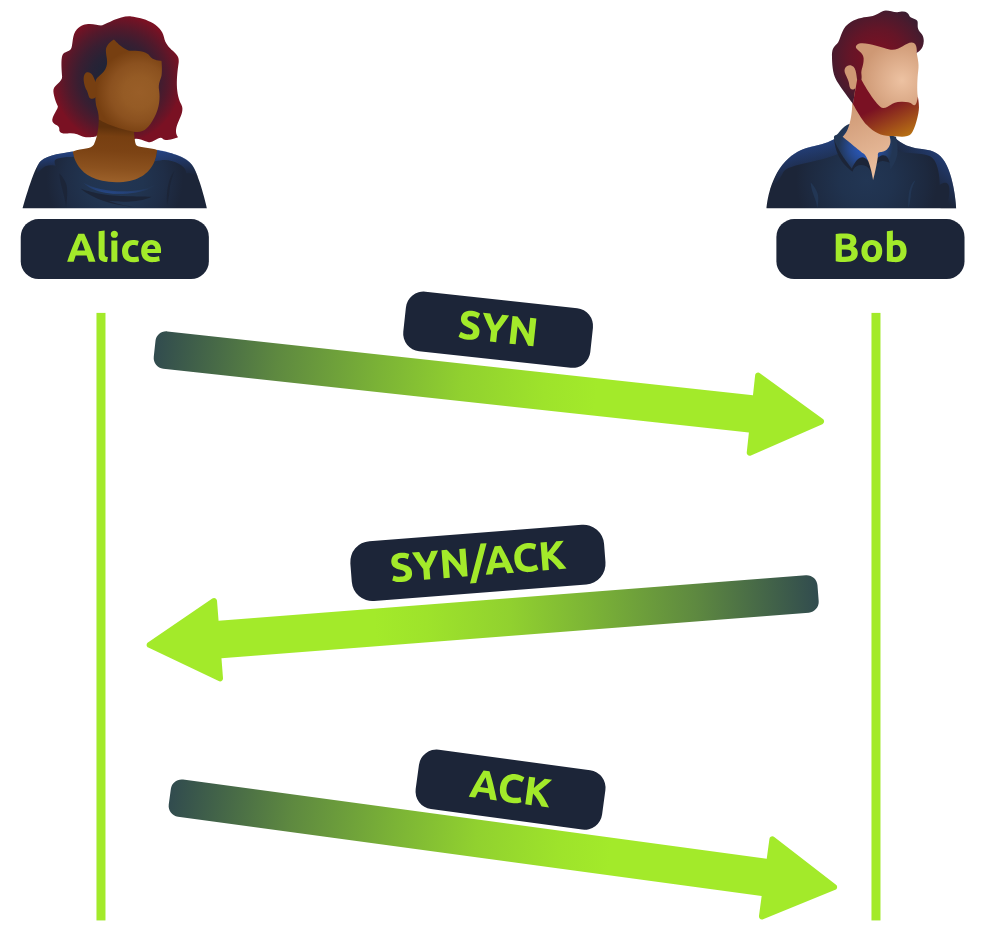
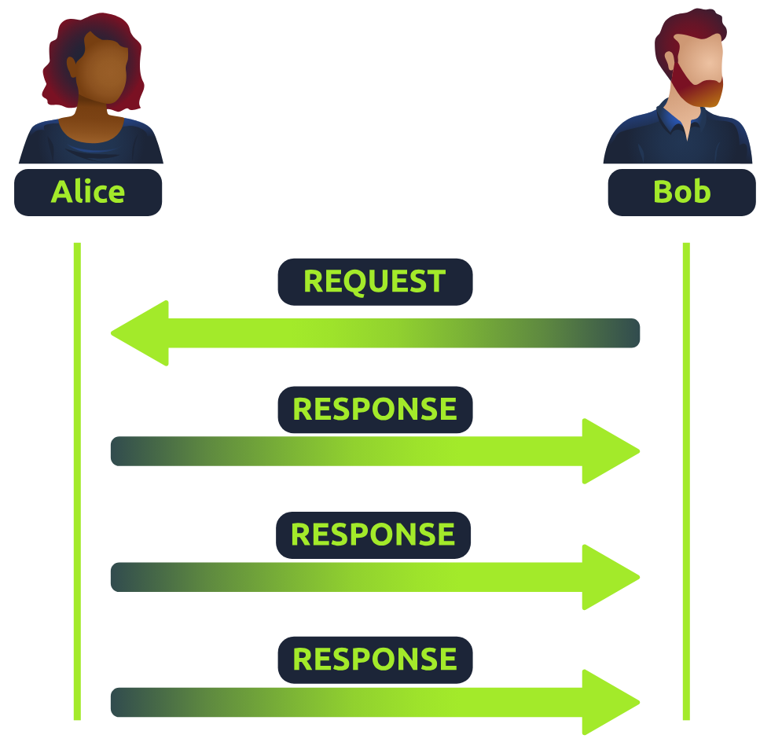
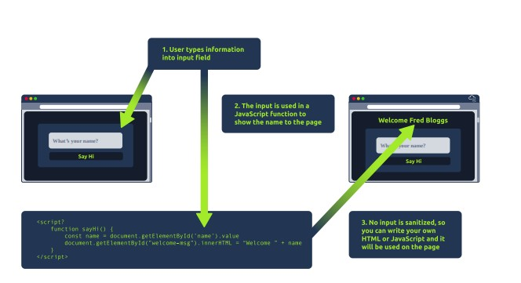
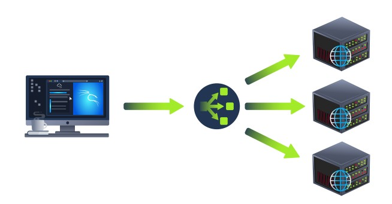
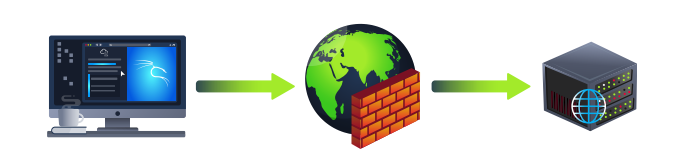
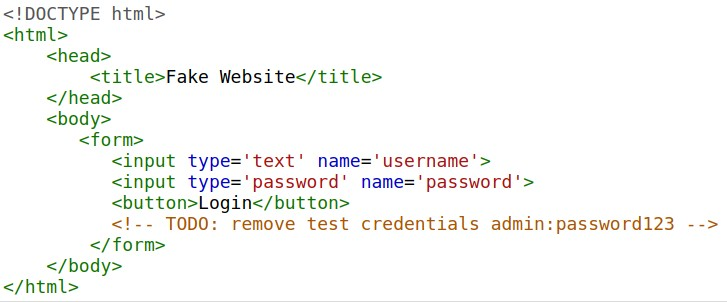
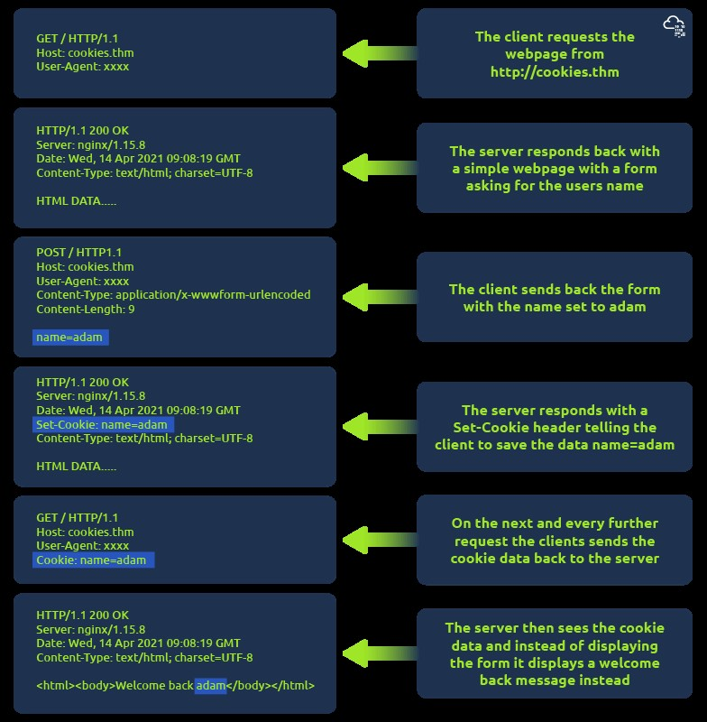

# 🤖 Networking 101

*IP Addressing, Ports, Protocols, The OSI Model, Firewalls & VPNs, etc.*

---

## ⚡ Quick Navigation (Table of Contents)

* [The OSI Model](#the-osi-model-p-d-n-t-s-p-a)
* [IP Addressing & MAC Addresses](#ip-addressing-and-mac-addresses)
* [Core Protocols: TCP & UDP](#tcp---transmission-control-protocol)
    * [TCP Handshake](#tcp-handshake-messages)
    * [UDP Protocol](#udp---user-datagram-protocol)
* [Network Services: ARP, DHCP, DNS](#arp---address-resolution-protocol)
* [Full Port Lists](#ports-full-list)
* [Web Technologies: HTTP, DNS, HTML](#websites-web-servers-http-html-etc)
* [Network Infrastructure: Firewalls & VPNs](#firewalls)
* [Subnetting](#subnetting)

---

## The OSI Model: P-D-N-T-S-P-A

*Open Systems Interconnection Model*

### Network Layers Simplified (OSI Model)

- **Layer 1 - Physical:** Cables, Wires, etc
- **Layer 2 - Data Link:** MAC Address (Media Access control) i.e., Physical Address. A **switch** operates here.
- **Layer 3 - Network:** IP Addresses. A **router** operates here.
- **Layer 4 - Transport:** Transport layer (TCP, UDP & 3-way handshake)
- **Layer 5 - Session:** Session Management
- **Layer 6 - Presentation:** Media (MOV, JPEG, WMV)
- **Layer 7 - Application:** Application data (HTTP, SMTP, SSH, etc)

### "Please, Do, Not, Throw, Sausage, Pizza, Away"
*Mnemonic for network troubleshooting as well.*

1. **Physical** - Data Cables, Cat5, Cat6, etc
2. **Data Link** - Switching, MAC Addresses, etc
3. **Network** - IP Addressing, Routing, etc.
4. **Transport** - TCP/UDP
5. **Session** - Session Management
6. **Presentation** - WMV, JPEG, MOV, (media files)
7. **Application** - HTTP, SMTP, SSH, etc


*OSI Model 7 Layers diagram*

---

## IP Addressing & MAC Addresses

### IP Addresses

#### IP Classes:

1. **Class A:** 10.0.0.0
2. **Class B:** 172.16.0.0 to 172.31.0.0
3. **Class C:** 192.168.0.0 to 192.168.255.255
4. **Loopback:** 127.0.0.0 to 127.0.0.7
5. **APIPA:** 169.254.x.x
   - A **169.254.x.x** IP address is an **APIPA (Automatic Private IP Addressing)** address, which means that your computer or device was unable to obtain an IP address from a **DHCP (Dynamic Host Configuration Protocol) server**, such as a router or modem.

#### Local IP's
- 192.168.1.1
- 10.1.1.10
- 172.16.1.1

#### Public IP's
- Outside of the above IP ranges

### IPV4 - Internet Protocol Version 4
- Made of **32 bits** or **4 bytes**

### IPV6 - Internet Protocol Version 6
- Made up of **128 bits** or **16 bytes**

### NAT - Network Address Translation

**NAT (Network Address Translation)** is a technology that lets multiple devices on a private network (like your home Wi-Fi) share a single public IP address to access the internet.

Your router acts as a middleman, replacing private IP addresses with its public IP when sending data out, and then routing the responses back to the right device. This helps with security and conserves the limited number of public IP addresses available.

### MAC Addresses:

- **Hardware Network Identification**
- **Hardware Identifiers:** The first three pairs of Mac address
- **Layer 2 "Switching"**

---

## Core Protocols: TCP & UDP

### TCP - Transmission Control Protocol

*Connection-oriented, Used when reliability is needed, Uses a 3-way handshake.*

| Header | Description |
|--------|-------------|
| Source Port | This value is the port opened by the sender to send the TCP packet from. This value is chosen randomly (out of the ports from 0-65535 that aren't already in use at the time). |
| Destination Port | This value is the port number that an application or service is running on the remote host (the one receiving data); for example, a webserver running on port 80. Unlike the source port, this value is not chosen at random. |
| Source IP | This is the IP address of the device that is sending the packet. |
| Destination IP | This is the IP address of the device that the packet is destined for. |
| Sequence Number | When a connection occurs, the first piece of data transmitted is given a random number. We'll explain this more in-depth further on. |
| Acknowledgement Number | After a piece of data has been given a sequence number, the number for the next piece of data will have the sequence number + 1. We'll also explain this more in-depth further on. |
| Checksum | This value is what gives TCP integrity. A mathematical calculation is made where the output is remembered. When the receiving device performs the mathematical calculation, the data must be corrupt if the output is different from what was sent. |
| Data | This header is where the data, i.e. bytes of a file that is being transmitted, is stored. |
| Flag | This header determines how the packet should be handled by either device during the handshake process. Specific flags will determine specific behaviors, which is what we'll come on to explain below. |

### TCP Handshake Messages

*Uses a 3-way handshake: "Syn" Packet, "Syn Ack" Packet, "Ack" Packet.*

| Step | Message | Description |
|------|---------|-------------|
| 1 | SYN | A SYN message is the initial packet sent by a client during the handshake. This packet is used to initiate a connection and synchronise the two devices together (we'll explain this further later on). |
| 2 | SYN/ACK | This packet is sent by the receiving device (server) to acknowledge the synchronisation attempt from the client. |
| 3 | ACK | The acknowledgement packet can be used by either the client or server to acknowledge that a series of messages/packets have been successfully received. |
| 4 | DATA | Once a connection has been established, data (such as bytes of a file) is sent via the "DATA" message. |
| 5 | FIN | This packet is used to cleanly (properly) close the connection after it has been complete. |
| # | RST | This packet abruptly ends all communication. This is the last resort and indicates there was some problem during the process. For example, if the service or application is not working correctly, or the system has faults such as low resources. |


*TCP 3-way handshake between Alice and Bob*

1. **SYN** - Client: Here's my Initial Sequence Number(ISN) to SYNchronise with (0)
2. **SYN/ACK** - Server: Here's my Initial Sequence Number (ISN) to SYNchronise with (5,000), and I ACKnowledge your initial number sequence (0)
3. **ACK** - Client: I ACKnowledge your Initial Sequence Number (ISN) of (5,000), here is some data that is my ISN+1 (0 + 1)

### UDP - User Datagram Protocol

*Stateless Protocol, Streaming, DNS, VoIP, connectionless data.*

| Header | Description |
|--------|-------------|
| Time to Live (TTL) | This field sets an expiry timer for the packet, so it doesn't clog up your network if it never manages to reach a host or escape! |
| Source Address | The IP address of the device that the packet is being sent from, so that data knows where to return to. |
| Destination Address | The device's IP address the packet is being sent to so that data knows where to travel next. |
| Source Port | This value is the port that is opened by the sender to send the UDP packet from. This value is randomly chosen (out of the ports from 0-65535 that aren't already in use at the time). |
| Destination Port | This value is the port number that an application or service is running on the remote host (the one receiving the data); for example, a webserver running on port 80. Unlike the source port, this value is not chosen at random. |
| Data | This header is where data, i.e. bytes of a file that is being transmitted, is stored. |


*UDP request/response between Alice and Bob*

---

## Network Services: ARP, DHCP, DNS

### ARP - Address Resolution Protocol

*Layer 2/3 translation.*

- **ARP Request** - A message is broadcasted on the network to other devices asking, "What is the mac address that owns this IP address?"
- **ARP Reply** - With device's MAC Address

### DHCP - Dynamic Host Configuration Protocol

**DHCP (Dynamic Host Configuration Protocol)** is a system that automatically assigns **IP addresses** to devices on a network. It also provides other network details like the **subnet mask, gateway,** and **DNS servers**, so devices can connect and communicate properly.

- **DHCP Discover Packet** - Asks for IP
- **DHCP Offer Packet**
- **DHCP Request Packet** - Sent once offered an IP
- **DHCP ACK Packet** - Acknowledgement

### DNS - Domain Name System

**DNS (Domain Name System)** provides a simple way for us to communicate with devices on the internet without remembering complex numbers. It translates human-readable domain names (like tryhackme.com) into numerical IP addresses (like 104.26.10.229).

#### What happens when you make a DNS request

1. Your computer checks its **local cache**. If not found, a request goes to your **Recursive DNS Server** (often your ISP).
2. The Recursive Server checks its cache. If not found, it asks the **Root DNS Servers**.
3. The Root Servers redirect to the correct **Top-Level Domain (TLD) Server** (.com, .org, etc.).
4. The TLD Server directs to the domain's **Authoritative DNS Server** (Nameserver).
5. The Authoritative Server provides the specific **DNS Record** (A, AAAA, CNAME, etc.) back to the Recursive Server, which caches it (based on **TTL**) and relays it to your computer.


*DNS request process from client through recursive, root, and authoritative servers*

#### DNS Records

* **A Record:** Resolves to **IPv4** addresses (e.g., 104.26.10.229)
* **AAAA Record:** Resolves to **IPv6** addresses (e.g., 2606:4700:20::681a:be5)
* **CNAME Record:** Resolves to **another domain name** (e.g., store.tryhackme.com resolves to shops.shopify.com)
* **MX Record:** Resolves to the address of **email servers** for the domain, with a priority flag.
* **TXT Record:** Free text fields used for verification, anti-spam, etc.

### DNS Tools:

**NSLookUp** - Look up DNS, DNS Records, Mail DNS, etc
```
nslookup --type=MX website.com
nslookup --type=TXT website.com
```

## Common Networking, Ports & Protocols, Etc.

### Network Protocols (Routing)

- **OSPF:** Open Shortest Path First
- **RIP:** Routing Information Protocol

### Network Topologies

- Star
- Bus
- Ring

### Packets & Frames

- **Packets** - Data chunks at **Layer 3 (Network)**, contain IP addresses. Efficient for communication across networks.
- **Frames** - Data chunks at **Layer 2 (Data Link)**, contain MAC addresses.

---

## Ports *FULL LIST*

### Well-Known Ports (0-1023)

| Port(s) | Protocol | Description |
|---|---|---|
| **20/21** | **FTP** (File Transfer Protocol) | Data Transfer (20) / Control (21) |
| **22** | **SSH** (Secure Shell) | Encrypted remote login |
| **23** | **Telnet** | Unencrypted remote login |
| **25** | **SMTP** (Simple Mail Transfer Protocol) | Email sending |
| **53** | **DNS** (Domain Name System) | Name resolution |
| **67/68** | **DHCP** (Dynamic Host Configuration Protocol) | IP address assignment |
| **69** | **TFTP** (Trivial File Transfer Protocol) | Simple file transfer |
| **80** | **HTTP** (Hypertext Transfer Protocol) | Web traffic |
| **110** | **POP3** (Post Office Protocol v3) | Email retrieval |
| **119** | **NNTP** (Network News Transfer Protocol) | Newsgroup articles |
| **123** | **NTP** (Network Time Protocol) | Clock synchronization |
| **143** | **IMAP** (Internet Message Access Protocol) | Email retrieval |
| **161/162** | **SNMP** (Simple Network Management Protocol) | Network management |
| **179** | **BGP** (Border Gateway Protocol) | Inter-autonomous system routing |
| **389** | **LDAP** (Lightweight Directory Access Protocol) | Directory services |
| **443** | **HTTPS** (Hypertext Transfer Protocol Secure) | Secure web traffic |
| **465** | **SMTPS** (Secure SMTP) | Secure email sending |
| **514** | **Syslog** | System Logging |
| **515** | **LPD** (Line Printer Daemon) | Remote printing |
| **993** | **IMAPS** (Secure IMAP) | Secure email retrieval |
| **995** | **POP3S** (Secure POP3) | Secure email retrieval |

*Also, from the IP section:* **25, 587 (STARTLS), 2525** for SMTP, and **139 + 445** for SMB.

### Registered Ports (1024-49151)

- **1080** – SOCKS Proxy
- **1433/1434** – Microsoft SQL Server
- **1521** – Oracle Database
- **1701** – L2TP (Layer 2 Tunneling Protocol)
- **1723** – PPTP (Point-to-Point Tunneling Protocol)
- **3306** – MySQL Database
- **3389** – RDP (Remote Desktop Protocol)
- **5060/5061** – SIP (Session Initiation Protocol - VoIP)
- **5432** – PostgreSQL Database
- **8080** - Web Server, Web Proxy, etc.

### Dynamic/Private Ports (49152-65535)

#### QuickBooks Desktop 2020 and later ports:
- Uses port 8019

#### QuickBooks Desktop 2018 ports:
- Uses ports 8019, 56728, and 55378–55382

#### QuickBooks Desktop 2017 ports:
- Uses ports 8019, 56727, and 55373–55377

#### QuickBooks Point of Sale ports:
- **TCP (Incoming):** Uses ports 8040, 8443, 443, 2638, 46203, 46216–46220, 46225, 46228, 8024, 8025, 8035, and 8036
- **UDP (Outgoing):** Uses ports 2638, 8024, 8035, and 8036

#### QuickBooks Payments ports:
- Uses ports 8443 (UDP and TCP) and 443 (UDP and TCP)

### Ports Used by VPNs

- **UDP 1194** – OpenVPN (default port)
- **TCP/UDP 500** – IKE (Internet Key Exchange) for IPsec VPNs
- **UDP 4500** – NAT Traversal for IPsec VPNs
- **TCP 1723** – PPTP (Point-to-Point Tunneling Protocol)(Not recommended due to weak security)
- **UDP 1701** – L2TP (Layer 2 Tunneling Protocol)
- **TCP 443** – OpenVPN over HTTPS (used to bypass firewalls)
- **TCP 22** – SSH Tunneling for VPN-like functionality
- **TCP 465 / TCP 993** – Sometimes used by VPNs for secure email services

#### VPN Port Considerations:

- OpenVPN can be configured on **any port**, but **UDP 1194** is the default.
- IPsec-based VPNs (such as those used by Cisco, Fortinet, and others) primarily use **UDP 500 and UDP 4500**.
- Using **TCP 443** for OpenVPN allows VPN traffic to appear as regular HTTPS, helping to bypass network restrictions.

### Ports Used by NVR/DVR and Camera Systems

- **TCP 80** – HTTP (Web Interface for camera/NVR)
- **TCP 443** – HTTPS (Secure Web Interface)
- **TCP 554** – RTSP (Real-Time Streaming Protocol)
- **TCP/UDP 5000-5500** – RTP (Real-Time Transport Protocol for video/audio)
- **TCP 8080** – Alternate HTTP Port
- **UDP 3702** – ONVIF (Discovery of IP Cameras)
- **TCP/UDP 37777** – Common port for Dahua and some other brands
- **TCP 8000** – Commonly used by Hikvision
- **TCP 8554** – Alternative RTSP port
- **TCP 10000+** – Some cameras use high-numbered ports for proprietary streaming

### Ports Used by VoIP & IP Telephone Systems

#### 1. SIP (Session Initiation Protocol) – Used for call signaling

- **UDP/TCP 5060** – Standard SIP traffic (unencrypted)
- **TCP 5061** – Secure SIP (SIPS, encrypted using TLS)
- **UDP 5160** – Alternative SIP port used by some VoIP providers

#### 2. RTP (Real-time Transport Protocol) – Used for audio/video streaming

- **UDP 16384-32767** – Default RTP media ports (range varies by provider)
- **UDP 10000-20000** – Common alternative RTP range

#### 3. SRTP (Secure Real-time Transport Protocol) – Secure voice traffic

- Same as RTP ports, but encrypted (TLS/SSL)

#### 4. MGCP (Media Gateway Control Protocol) – Legacy protocol for VoIP gateways

- **UDP 2427** – MGCP Gateway communication
- **UDP 2727** – MGCP Call Agent communication

#### 5. H.323 – Alternative VoIP protocol (less common today)

- **TCP 1720** – Call signaling
- **TCP/UDP 1718-1719** – Gatekeeper communication
- **TCP/UDP 1024-65535** – Media streaming (RTP)

#### 6. IAX/IAX2 (Inter-Asterisk eXchange Protocol – Used by Asterisk PBX)

- **UDP 4569** – IAX2 (preferred over IAX)

#### 7. Proprietary VoIP Services (Common Provider Ports)

- **TCP 3478-3481** – STUN/TURN (NAT traversal for VoIP)
- **UDP 4000-4999** – Cisco VoIP (varies by model)
- **TCP 5222-5223** – XMPP (used in some VoIP apps like Google Voice)

---

## Websites, Web Servers, HTTP, HTML, Etc.

### Domains

#### TLD (Top-Level Domain)

A TLD is the most righthand part of a domain name (e.g., **.com**). There are two types: **gTLD** (Generic Top Level: .com, .org, .edu) and **ccTLD** (Country Code Top Level Domain: .ca, .co.uk).

#### Second-Level Domain

The part to the left of the TLD (e.g., **tryhackme** in tryhackme.com). Limited to 63 characters and uses a-z, 0-9, and hyphens (cannot start or end with hyphens or have consecutive hyphens).

#### Subdomain

Sits to the left of the Second-Level Domain (e.g., **admin** in admin.tryhackme.com). Follows the same creation rules as the Second-Level Domain.

### Websites; HTML, CSS, JavaScript, Etc.

* **Front End (Client-Side)** - the way your browser renders a website.
* **Back End (Server-Side)** - a server that processes your request and returns a response.

#### Websites are primarily created using:

- **HTML**, to build websites and define their structure
- **CSS**, to make websites look pretty by adding styling options
- **JavaScript (JS)**, implement complex features on pages using interactivity

### HyperText Markup Language (HTML)

The language websites are written in. **Elements (tags)** are the building blocks that tell the browser how to display content.

* `<!DOCTYPE html>`: Defines that the page is an HTML5 document.
* `<html>`: The root element.
* `<head>`: Contains information about the page (e.g., title).
* `<body>`: Defines the content that is shown in the browser.
* `<h1>`, `<p>`: Define headings and paragraphs.

Tags can contain **attributes** (`class`, `src`, `id`). **Element id's** are unique; **class attributes** can be shared.

### JavaScript (JS)

Allows pages to become **interactive**. It controls the functionality of web pages and can dynamically update the page in real-time.

JS is added within the page source code using `<script>` tags or included remotely via the `src` attribute.

### Exposing Sensitive Data

Occurs when a website doesn't properly protect (or remove) sensitive clear-text information (like credentials or hidden links) to the end-user, often found in HTML or JavaScript source code.

### HTML Injection

A vulnerability where an attacker injects HTML code into a vulnerable website due to a failure to **sanitize** (filter) user input before it is displayed on the page.


*Example of HTML injection through a form input*

### Other Components (Infrastructure)

#### Load Balancers

Ensures high traffic websites can handle the load and provides a failover if a server becomes unresponsive. Uses algorithms like **round-robin** or **weighted** to distribute client requests to servers and performs **health checks**.


*Load balancer distributing traffic across multiple servers*

#### CDN (Content Delivery Networks)

Hosts static files (JS, CSS, Images) across thousands of servers globally. Directs a user's request to the **nearest server** to cut down on traffic and latency.

#### Databases

Used by webservers to store and recall information for users. Common types: MySQL, MSSQL, MongoDB, Postgres.

#### WAF (Web Application Firewall)

Sits between your web request and the web server to protect the server from attacks. It analyzes requests for common attack techniques, checks for bots, and utilizes **rate limiting**.


*Web Application Firewall protecting a web server*

### HTTP - HyperText Transfer Protocol

The set of rules used for communicating with web servers.

### HTTPS: HyperText Transfer Protocol Secure

The **secure version of HTTP**. Data is **encrypted** and provides assurance that you're talking to the correct web server.

### HTTP Methods

- **GET Request:** Used for **getting** information from a web server.
- **POST Request:** Used for **submitting data** (creating new records).
- **PUT Request:** Used for **submitting data to update** information.
- **DELETE Request:** Used for **deleting** information/records.

### HTTP Status Codes

| Range | Category | Description |
|-------|----------|-------------|
| 100-199 | Information Response | First part of request accepted, continue. |
| **200-299** | **Success** | Request was successful. |
| 300-399 | Redirection | Redirects client's request to another resource. |
| 400-499 | Client Errors | Error with the client's request. |
| 500-599 | Server Errors | Error happening on the server-side. |

#### Common HTTP Status Codes:

| Status Code | Description |
|-------------|-------------|
| **200 - OK** | The request was completed successfully. |
| 201 - Created | A resource has been created. |
| 301 - Moved Permanently | Permanent redirect to a new location. |
| 302 - Found | Temporary redirect to a new location. |
| 400 - Bad Request | Something was wrong or missing in the client's request. |
| 401 - Not Authorised | Authentication (login) is required to view the resource. |
| 403 - Forbidden | You do not have permission to view the resource. |
| 405 - Method Not Allowed | The resource does not allow the requested method (e.g., trying GET when expecting POST). |
| **404 - Page Not Found** | The page/resource you requested does not exist. |
| 500 - Internal Service Error | A server-side error with the request. |
| 503 - Service Unavailable | Server cannot handle the request (overloaded or down for maintenance). |

### URL - Uniform Resource Locator

An instruction on how to access a resource on the internet.

!https://www.merriam-webster.com/dictionary/structure(../images/url-structure.jpg)
*URL structure showing scheme, user, host, port, path, query string, and fragment*

- **Scheme:** Protocol to use (HTTP, HTTPS, FTP).
- **User:** Authentication credentials (username:password).
- **Host:** Domain name or IP address of the server.
- **Port:** The port to connect to (default 80/443).
- **Path:** File name or location of the resource.
- **Query String:** Extra information sent to the path (e.g., `?id=1`).
- **Fragment:** Reference to a location on the actual page.

### Web Requests & Responses

It's possible to make a request to a web server with just one line **"GET / HTTP/1.1"**


*Diagram showing HTTP request components*

#### Example Request:
```
GET / HTTP/1.1
Host: tryhackme.com
User-Agent: Mozilla/5.0 Firefox/87.0
Referer: https://tryhackme.com/
```

**Breakdown of each line in this request:**

- **Line 1:** This request is sending the GET method, request the home page with / and telling the web server we are using HTTP protocol version 1.1.
- **Line 2:** We tell the web server we want the website tryhackme.com
- **Line 3:** We tell the web server we are using the Firefox version 87 Browser
- **Line 4:** We are telling the web server that the web page that referred us to this one is https://tryhackme.com
- **Line 5:** HTTP requests always end with a blank line to inform the web server that the request has finished.

#### Example Response:

```
HTTP/1.1 200 OK
Server: nginx/1.15.8
Date: Fri, 09 Apr 2021 13:34:03 GMT
Content-Type: text/html
Content-Length: 98

<html>
<head>
<title>TryHackMe</title>
</head>
<body>
Welcome To TryHackMe.com
</body>
</html>
```

**Breakdown of each line of the response:**

- **Line 1:** HTTP 1.1 is the version of the HTTP protocol the server is using and then followed by the HTTP Status Code in this case "200 Ok" which tells us the request has completed successfully.
- **Line 2:** This tells us the web server software and version number.
- **Line 3:** The current date, time and timezone of the web server.
- **Line 4:** The Content-Type header tells the client what sort of information is going to be sent, such as HTML, images, videos, pdf, XML.
- **Line 5:** Content-Length tells the client how long the response is, this way we can confirm no data is missing.
- **Line 6:** HTTP response contains a blank line to confirm the end of the HTTP response.
- **Lines 7-14:** The information that has been requested, in this instance the homepage.

### Request & Response Headers:

#### Common Request Headers (Client to Server)

  - **Host:** Specifies the website being requested from the server.
  - **User-Agent:** Browser software and version.
  - **Content-Length:** Size of the data being sent.
  - **Accept-Encoding:** Compression methods the browser supports.
  - **Cookie:** Data sent to remind the server who the user is.

#### Common Response Headers (Server to Client)

  - **Set-Cookie:** Information to store on the client's browser.
  - **Cache-Control:** How long content should be stored locally (cached).
  - **Content-Type:** Type of data being returned (HTML, image, etc.).
  - **Content-Encoding:** Compression method used for the data.

### Cookies

Cookies are saved when a client receives a **"Set-Cookie"** header. They are sent back with every further request to help the web server track the user, as HTTP is **stateless**.


*Example showing how cookies are set and used across multiple requests*

## Web Servers

### What is a Web Server?

A software (Apache, Nginx, IIS, NodeJS) that listens for connections and uses **HTTP** to deliver web content from its **root directory** (e.g., `/var/www/html` or `C:\inetpub\wwwroot`).

### Virtual Hosts

Allows a single web server to host **multiple websites** with different domain names by checking the `Host` header in the request and matching it against configuration files.

### Static Vs Dynamic Content

  - **Static Content:** Content that **never changes** (pictures, JS, CSS files). Directly served.
  - **Dynamic Content:** Content that **changes** with different requests (e.g., a blog homepage updated with new entries). Handled by the **Backend**.

### Scripting and Backend Languages

Languages (PHP, Python, Ruby, NodeJS) that make a website interactive. They handle processing, database interaction, and external services. The code is executed on the server (**Backend**) and the client only sees the resulting HTML (**Frontend**).

-----

## Firewalls

*Operate at Layer 3 and Layer 4 of the OSI Model; sometimes Layer 7.*

| Firewall Category | Description |
|-------------------|-------------|
| **Stateful** | Uses the **entire connection** information to make decisions. Dynamic, resource-intensive. Can block an entire host based on bad behavior within a connection. |
| **Stateless** | Uses a **static set of rules** to inspect **individual packets**. Less resource-intensive but "dumber"—only effective if rules are exactly matched. |

-----

## VPN

| Benefit | Description |
|---------|-------------|
| **Connects Networks** | Allows networks in different geographical locations to be connected (e.g., business offices). |
| **Offers Privacy** | Uses **encryption** to protect data from sniffing, especially on public WiFi. |
| **Offers Anonymity** | Hides traffic from ISPs and intermediaries, though anonymity depends on the VPN provider's logging policy. |

### VPN Technologies:

#### PPP (Point-to-Point Protocol)

Used by PPTP to allow for **authentication** and provide **encryption**. Uses a private key and public certificate for connection.

#### PPTP (Point-to-Point Tunneling Protocol)

Allows data from PPP to travel and leave a network (non-routable data becomes routable). Easy to set up but uses **weak encryption**.

#### IPSec (Internet Protocol Security)

Encrypts data using the existing IP framework. **Difficult to set up** but provides **strong encryption** and is widely supported.

-----

## Subnetting
```
192.168.1.1:
192 = 8 Bits
4 Sections of Address Numbers (192.168.1.1) = 32 Bits

11111111.11110110.11110011.11111010 = IP Address in Bits

128 64 32 16 8 4 2 1
  1  1  1  1 1 1 1 1 = 255
  0  0  0  0 0 1 1 1 = 7
```

**Subnetting is the process of dividing a network into smaller subnetworks called subnets.**

- It allows for more efficient use of IP addresses and facilitates network management and routing. Subnetting is commonly used in IPv4 networks.
- Subnetting involves borrowing bits from the host portion of an IP address to create a subnet identifier.
- By doing this, a network can be divided into multiple subnets, each with its own range of IP addresses.
- CIDR (Classless Inter-Domain Routing) notation is a method used to represent IP addresses and their corresponding subnet masks.
- It specifies the network prefix length, which indicates the number of bits used for the network portion of the IP address.
- CIDR notation is expressed by appending a forward slash (/) followed by the prefix length to the IP address.

### Examples to Illustrate Subnetting & CIDR Notation:

#### Consider the IP address: 192.168.0.0/24

- With a /24 prefix length, the subnet mask for this network would be 255.255.255.0. This means that the first three octets are reserved for the network, and the last octet can be used for addressing hosts within the subnet.
- To subnet this network further, additional bits can be borrowed from the host portion.
- For instance, if we borrow 2 bits, we can create 4 subnets. The subnet mask would become 255.255.255.192 (in binary: 11111111.11111111.11111111.11000000).

The four resulting subnets would be:

1. Subnet 1: 192.168.0.0/26 (network range: 192.168.0.0 - 192.168.0.63)
2. Subnet 2: 192.168.0.64/26 (network range: 192.168.0.64 - 192.168.0.127)
3. Subnet 3: 192.168.0.128/26 (network range: 192.168.0.128 - 192.168.0.191)
4. Subnet 4: 192.168.0.192/26 (network range: 192.168.0.192 - 192.168.0.255)

**Each subnet can then be assigned to a different segment or used for different purposes within the network.**

**CIDR notation provides a concise way to represent networks and subnets by specifying the prefix length. It allows for flexibility in defining network boundaries and enables efficient address allocation in IP networking.**

In this example, the IP address is in the format of "192.168.0.0" and the "/24" represents the prefix length, indicating that the first 24 bits represent the network portion of the IP address, while the remaining 8 bits represent the host portion.
